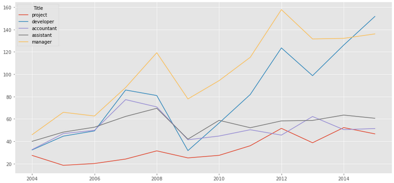
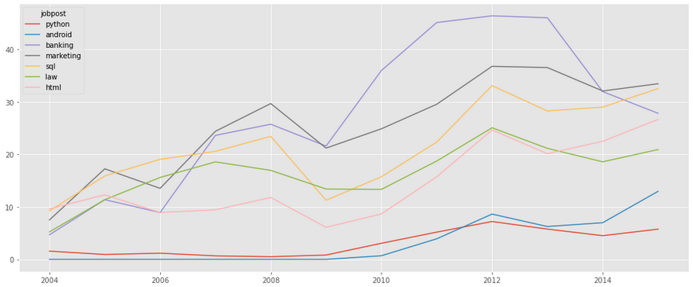
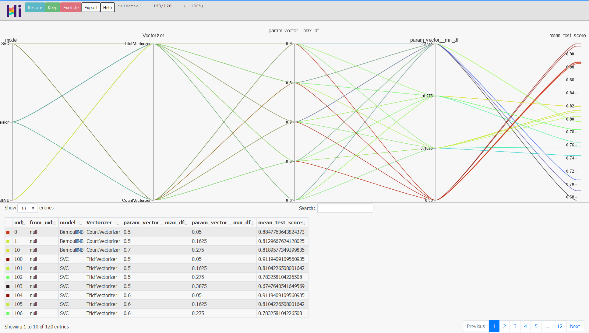
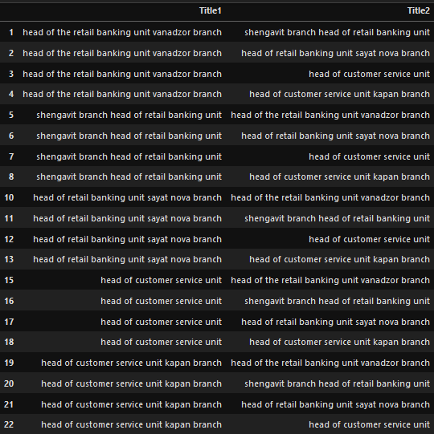

# Job_Posting

The main business objectives are to understand the dynamics of the labor market of Armenia using the online job portal post as a proxy. A secondary objective is to implement advanced text analytics as a proof of concept to create additional features.
 
# Analysis:

- **Job Nature and Company Profiles** : What are the types of jobs that are in demand in Armenia? How are the job natures changing over time?

- **Desired Characteristics and Skill-Sets** : What are the desired characteristics and skill-set of the candidates based on the job description dataset? How these are desired characteristics changing over time?

- **IT  Job Classification** : Build  a  classifier  that  can  tell  us  from  the  job  description  and  company description whether a job is IT or not, so that this column can be automatically populated for new job postings. After doing so, understand what important factors are which drives this classification.

- **Similarity of Jobs** : Given a job title, find the 5 top jobs that are of a similar nature, based on the job post.

